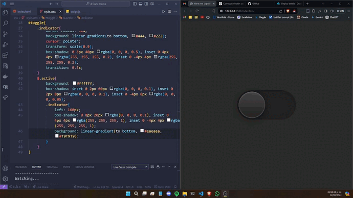

# Dark and Light Theme Toggle

Este proyecto implementa un simple tema de alternancia entre modo oscuro y claro usando HTML, SCSS y JavaScript.

## Descripción

El proyecto consiste en un interruptor (toggle) que permite a los usuarios cambiar entre un tema oscuro y un tema claro. Al hacer clic en el interruptor, el fondo del sitio web cambiará de color y se aplicarán diferentes estilos para simular los modos oscuro y claro.

## Vista Previa



## Demo

Puedes probar el proyecto en vivo en el siguiente enlace: [Dark and Light Theme Toggle](https://dark-and-white-theme.netlify.app/)

## Estructura del Proyecto

El proyecto está organizado en los siguientes archivos:

- `index.html`: Contiene la estructura HTML del proyecto.
- `css/style.css`: Contiene los estilos CSS para el proyecto.
- `script.js`: Contiene el código JavaScript para manejar el evento de clic en el interruptor.


## Instalación y Uso

1. Clona el repositorio:

```bash
git clone https://github.com/tu-usuario/dark-and-light-theme.git
```

2. Navega al directorio del proyecto:

```bash
cd 4 DARK THEME
```

3. Abre el archivo `index.html` en tu navegador para ver el proyecto en acción o accede a: https://dark-and-white-theme.netlify.app/

## Contribución

Si deseas contribuir a este proyecto, por favor sigue estos pasos:

1. Haz un fork del proyecto.
2. Crea una nueva rama (git checkout -b feature/nueva-funcionalidad).
3. Realiza tus cambios y haz commit de ellos (git commit -m 'Agrega nueva funcionalidad').
4. Sube tus cambios a la rama (git push origin feature/nueva-funcionalidad).
5. Abre un Pull Request.
